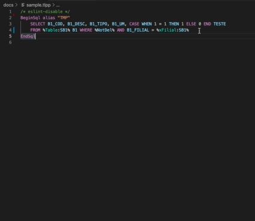
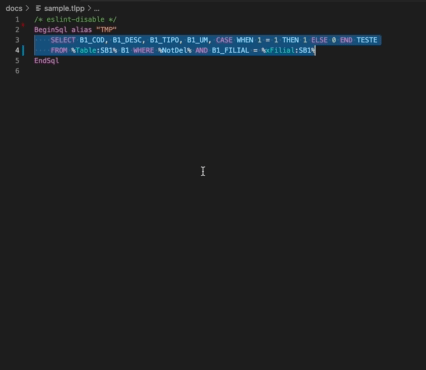
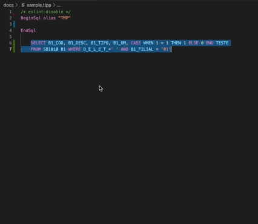

<!--  -->

# Beautify ADVPL/TLPP

Embelezador de código ADVPL/TLPP para ter uma visão mais legível.

## Uso
1. Selecione a parte do código que deseja indentar.
2. Ative o menu de contexto (clique direito), o atalho do teclado, ou o comando

| Comando                      	  | Mac OSX             | Windows/Linux        	|
|---------------------------------|---------------------|----------------------	|
| Beautify AdvPL                  | `CMD+i CMD+a`       | `CTRL+i CTRL+a`      	|
| Beautify AdvPL Ordem Alfabética | `CMD+i CMD+SHIFT+a` | `CTRL+i CTRL+SHIFT+a`	|
| Resetar Indentação              | `CMD+i CMD+s`       | `CTRL+i CTRL+s`      	|
| Beautify SQL                    | `CMD+i CMD+q`       | `CTRL+i CTRL+q`      	|
| Copiar como SQL                 | `CMD+SHIFT+c`       | `CTRL+SHIFT+c`	    |
| Colar como Embbedded SQL        | `CMD+SHIFT+v`       | `CTRL+SHIFT+v`      	|

## Recursos

Esta extensão vai facilitar a visualização do seu código, tornando-o mais legível. Ela vai realizar a indentação dos seguintes identificadores:

| Descrição   | Exemplo                        
|-------------|--------------------------------
| Atribuição  | `local aVar := {} as array`
| Arrays  	  | `{a, b, c, d}`
| Métodos New | `TRCell():New(oSec, "A1_COD","SA1")`
| AADD        | `aadd(aArray, {nPar1, cPar2})`

*Futuramente mais identificadores poderão ser adicionados.*

As seguintes indentações estão disponíveis:

### Beautify AdvPL (CTRL+I CTRL+A)

### Beautify AdvPL com ordenação alfabética (CTRL+I CTRL+SHIFT+A)

### Reset Indentação (CTRL+I CTRL+S)

É possível indentar o seu código Embbedded SQL, utilize o comando (CTRL+I CTRL+Q)
### Beautify SQL (CTRL+I CTRL+Q)

É possível tambêm copiar o seu código do Embedded SQL convertido para SQL nativa, removendo identificadores do Advpl

### Copiar como SQL (SHIFT+CTRL+C)

É possível colar o seu código SQL nativa convertido para Embedded SQL, adicionando identificadores do Advpl

### Colar como Embedded SQL (SHIFT+CTRL+V)

## Erros conhecidos

Caso encontre, nos avise.

## Notas de Release

[Veja o CHANGELOG para detalhes](./CHANGELOG.md)