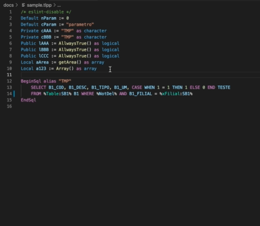

<!--  -->

# Indentação legível

Identação de declaração de variáveis de forma legível para código advpl/tlpp.

Extensão baseada na [Readable Indent](https://marketplace.visualstudio.com/items?itemName=cnojima.readable-indent) extensão feita para JS e portada para funcionar no advpl/tlpp

## Recursos

Esta extensão vai facilitar a visualização do seu código, tornando-o mais legível. Ela vai realizar a indentação dos seguintes identificadores:

| Descrição                     | Identificador                  |
|------------------------------	|------------------------------- |
| Atribuição de variáveis       | `:=`       	                 |
| Arrays  	                    | `{a, b, c, d}` 	             |
| Métodos New                   | `:new(param1, nPar2, lPar3)`   |
| AADD                          | `aadd(aArray, {nPar1, cPar2})` |

*Futuramente mais identificadores poderão ser adicionados.*

As seguintes indentações estão disponíveis:

### Indentação

### Indentação com ordenação alfabética

## Uso
1. Selecione a parte do código que deseja indentar.
2. Ative o menu de contexto (clique direito), o atalho do teclado, ou o comando

| Comando                      	| Mac OSX             	| Windows/Linux         	|
|------------------------------	|---------------------	|-----------------------	|
| Indentação                    | `cmd-i cmd-a`       	| `ctrl-i ctrl-a`       	|
| Indentação Ordem Alfabética  	| `cmd-i cmd-shift-a` 	| `ctrl-i ctrl-shift-a` 	|
| Resetar Indentação            | `cmd-i cmd-s`       	| `ctrl-i ctrl-s`       	|

## Erros conhecidos

Caso encontre, nos avise.

## Notas de Release

[Veja o CHANGELOG para detalhes](./CHANGELOG.md)